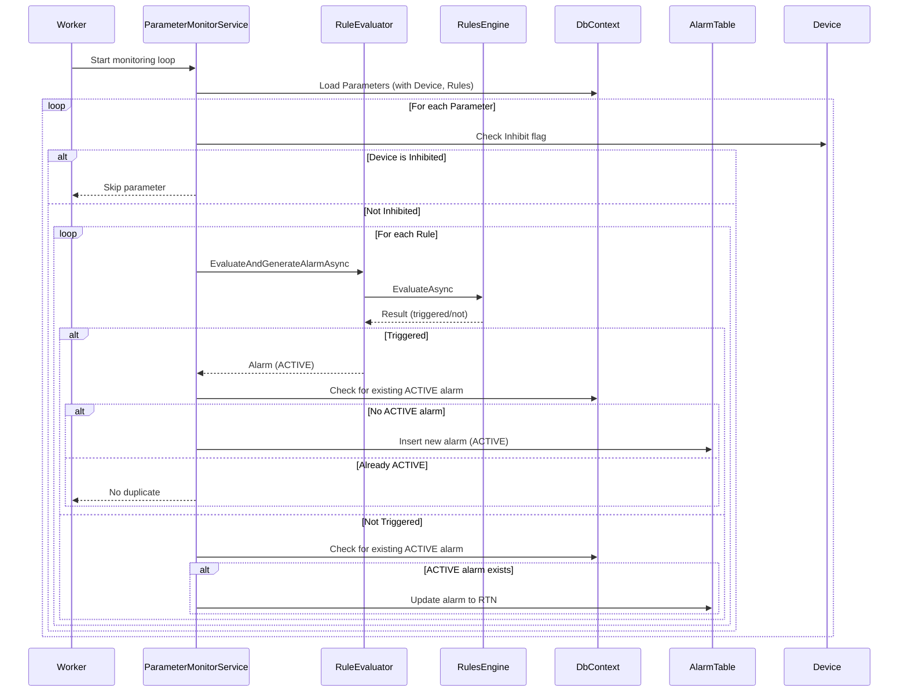
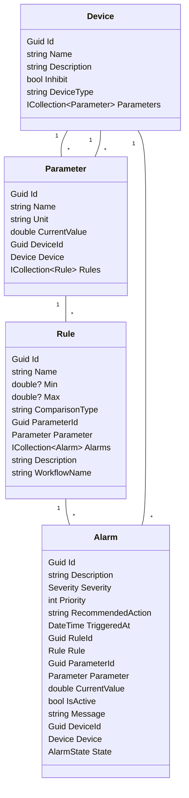

# DeviceAlarmSystem: Design & Architecture

## 1. Use Cases

### UC1: Device Parameter Monitoring
- System continuously monitors device parameters (e.g., temperature, pressure).
- If a parameter violates a rule, an alarm is generated.

### UC2: Alarm State Management
- Alarms transition through states: ACTIVE, ACK, RTN, ACKRTN.
- Duplicate ACTIVE alarms are prevented.
- Alarms return to normal (RTN) when the condition clears.

### UC3: Device Inhibit
- If a device is inhibited, no alarms are generated for its parameters.

### UC4: Device Type Management
- Devices are categorized by type (Pump, Motor, Valve, etc.) for reporting and filtering.

### UC5: Alarm Acknowledgement
- Operators can acknowledge alarms, changing their state to ACK or ACKRTN.

---

## 2. Sequence Diagram: Alarm Generation & State Transition

---

## 3. Class Diagram (Simplified)

---

## 4. Database Structure & Relations

- **Devices** (Id, Name, Description, Inhibit, DeviceType)
- **Parameters** (Id, Name, Unit, CurrentValue, DeviceId)
- **Rules** (Id, Name, Min, Max, ComparisonType, ParameterId, Description, WorkflowName)
- **Alarms** (Id, Description, Severity, Priority, RecommendedAction, TriggeredAt, RuleId, ParameterId, CurrentValue, IsActive, Message, DeviceId, State)

**Relations:**
- Device 1--* Parameter
- Parameter 1--* Rule
- Rule 1--* Alarm
- Alarm *--1 Device

---

## 5. Component Relations (Signals/Interactions)

- **Worker** triggers **ParameterMonitorService** on schedule.
- **ParameterMonitorService** loads parameters, devices, and rules from **DbContext**.
- For each parameter, if device is not inhibited, rules are evaluated via **RuleEvaluator**.
- **RuleEvaluator** uses **RulesEngine** to evaluate rule expressions.
- If triggered, **ParameterMonitorService** checks for existing alarms and updates/inserts as needed.
- **DbContext** persists all changes.

---

## 6. Microsoft RulesEngine Component

- **Purpose:** Evaluates business rules dynamically using expressions.
- **Capabilities:**
    - Supports complex expressions, workflows, and nested rules.
    - Can load rules from code, JSON, or database.
    - Supports input mapping, custom actions, and result aggregation.
    - Integrates with .NET dependency injection.
- **Usage in DeviceAlarmSystem:**
    - Each rule is mapped to a workflow.
    - Parameter values are passed as inputs (e.g., input1).
    - Expressions like `input1 > 80` are evaluated at runtime.
- **Scaling & Performance:**
    - Stateless and thread-safe; can be used in parallel for high-throughput scenarios.
    - Rule evaluation is fast (in-memory expression compilation).
    - For large rule sets, consider batching and caching workflows.
    - Database and I/O are the main bottlenecks; optimize queries and use async operations.

---

## 7. Scaling & Performance Considerations

- **Horizontal Scaling:**
    - Multiple worker instances can run in parallel (stateless design).
    - Use distributed locking or partitioning if needed for high-frequency alarms.
- **Database:**
    - Use indexes on frequently queried columns (e.g., ParameterId, RuleId, State).
    - Archive or purge old alarms to keep tables performant.
- **RuleEngine:**
    - Workflows can be cached in memory for fast access.
    - Avoid excessive rule complexity in a single workflow.
- **Monitoring:**
    - Log alarm transitions and system health.
    - Use metrics to track alarm rates and processing latency.

---

## 8. Extensibility

- Add new device types, rules, or alarm states by updating the database and models.
- Integrate with external notification systems (email, SMS, SCADA) via event handlers.
- Support for user-defined rules and dynamic workflows.

---

## 9. References
- [Microsoft RulesEngine GitHub](https://github.com/microsoft/RulesEngine)
- [EF Core Documentation](https://learn.microsoft.com/en-us/ef/core/)
- [Mermaid Diagrams](https://mermaid-js.github.io/mermaid/#/)
